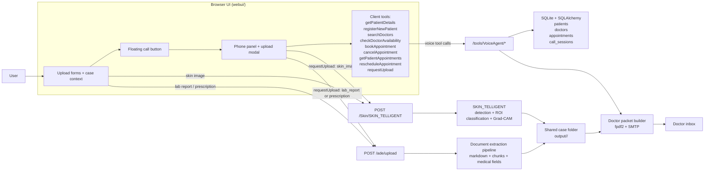
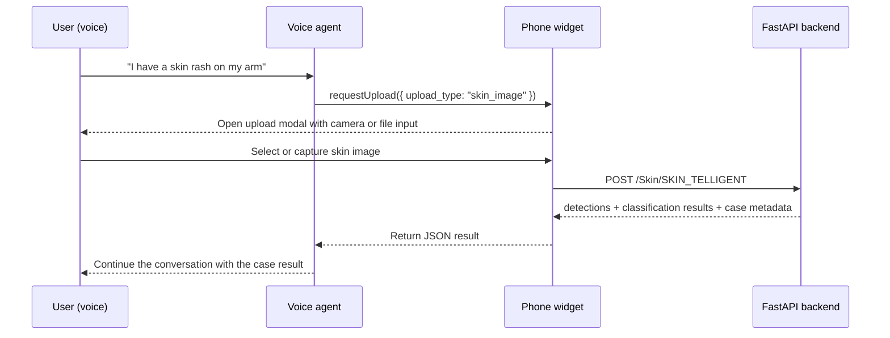
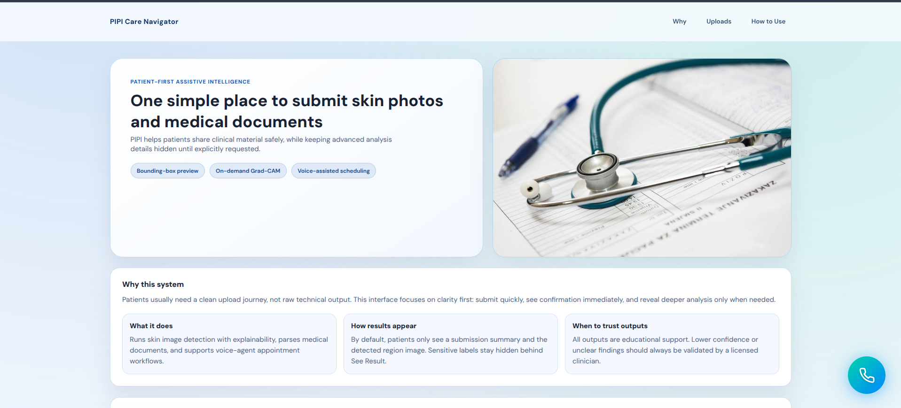
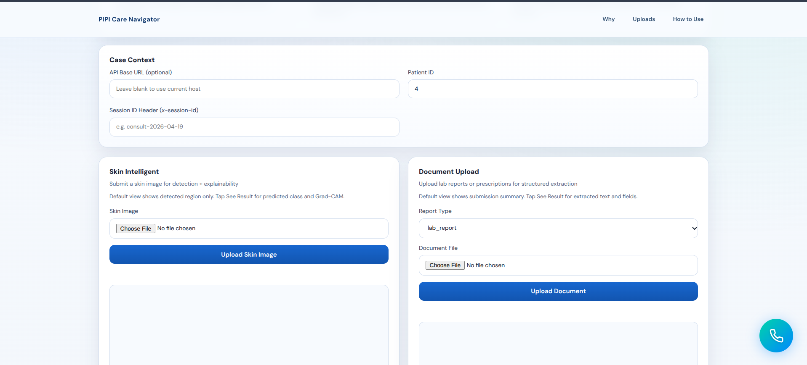

# PIPI

<p align="center"><strong>Patient Intelligence & Processing Interface</strong></p>

<p align="center">
  <a href="https://www.python.org/"></a>
  <a href="https://fastapi.tiangolo.com/"></a>
  <a href="https://pytorch.org/"></a>
  <a href="https://www.docker.com/"></a>
  <a href="LICENSE"></a>
</p>

PIPI is an AI-powered medical upload and care-navigation system built on FastAPI. In this repo, skin-image analysis, document extraction, voice-assisted scheduling, and backend doctor handoff are brought into one case-based workflow instead of being handled as separate tools.

> Medical disclaimer: This project is built for research and educational use only. It is not a diagnostic tool and should not be used as a substitute for licensed clinical judgment.

## Overview

PIPI is designed for one practical problem: patient cases arrive as a mix of photos, reports, prescriptions, and scheduling needs, but those inputs usually live in separate tools.

This project brings them together in one interface:

- skin images go through the `SKIN_TELLIGENT` pipeline for detection, classification, and Grad-CAM explainability
- medical documents go through a structured extraction pipeline that returns markdown, chunks, and medical fields
- the floating call button opens a voice agent that can manage patient lookup and appointment actions while also triggering uploads from the call UI
- a shared `patient_id` or `x-session-id` keeps outputs grouped under one case folder in `output/`
- when an appointment is booked, the backend can generate a doctor case packet PDF and email it with the original uploaded files attached

The result is a cleaner pre-visit workflow where patient material is organized before the appointment, reducing repeated intake and saving clinician time.

## Problem Statement

In a real care journey, a single case may involve:

- a skin photo that needs visual analysis
- a lab report or prescription that needs structured extraction
- doctor search and appointment booking before the visit

When these steps live in separate systems, the case becomes fragmented. Context is lost between uploads, extracted results, and scheduling actions.

## Solution

PIPI solves that with a unified case workflow:

- one UI for skin uploads, document uploads, and scheduling support
- one backend for vision, document parsing, and voice-agent tools
- one case context for outputs tied to a patient or session
- one backend doctor handoff that can assemble the case folder into a doctor-facing report package
- one patient-facing entry point that can escalate into richer clinical support when needed

The floating call button is not just a voice shortcut. In this repo it can open an in-call upload modal and send skin images or documents straight to the backend.

## Project Lineage

`SKIN_TELLIGENT` inside PIPI is an evolution of earlier standalone work, now integrated into a broader patient workflow.

- [Original SKIN_TELLIGENT project](https://github.com/mehraj-alom/SKIN_TELLIGENT)
- [Earlier SKIN_DISEASE_CLASSIFIER (`skinV0`)](https://github.com/mehraj-alom/SKIN_DISEASE_CLASSIFIER/tree/skinV0)
- [Updated training notebook](https://www.kaggle.com/code/mehrajalomtapadar/notebooka1e763f51a)

## Architecture



## Voice-Assisted Upload Flow



## Tech Stack

| Layer | Technology | Purpose |
| --- | --- | --- |
| Backend API | Python, FastAPI, Uvicorn | Core application and HTTP endpoints |
| Vision | PyTorch, Torchvision, OpenCV | Skin detection, classification, preprocessing, explainability |
| Detection | YOLO-style ONNX detector loaded through OpenCV DNN | Localizes skin regions before classification |
| Classification | EfficientNet-B4 (transfer learning) | 27-class skin condition prediction |
| Explainability | Grad-CAM++ | Visual attribution over skin regions |
| Document pipeline | Python-based document extraction stack | Extracts markdown, chunks, and structured medical fields |
| Voice workflow | ElevenLabs browser client + FastAPI tools | Voice-guided patient lookup, scheduling, and upload triggering |
| Doctor handoff | fpdf2 + SMTP | Builds doctor-facing case packets and emails them with original uploads attached |
| Database | SQLite, SQLAlchemy, Alembic | Patients, doctors, appointments, and call sessions |
| Frontend | HTML, CSS, JavaScript | Upload UI and floating phone widget |
| Packaging | Docker, Docker Compose | Local and containerized deployment |
| Testing | Pytest | Router and workflow validation |

## SKIN_TELLIGENT

`SKIN_TELLIGENT` is the vision core of PIPI. In this project it is presented as the updated version of the earlier standalone work, with improved overall results.

This project uses `EfficientNet-B4` for transfer learning. In the 27-class setting, training a classifier from scratch did not produce a strong classification report, so transfer learning was used to improve generalization and overall performance.

### Pipeline

| Stage | Technology | What it does |
| --- | --- | --- |
| Detection | ONNX model through OpenCV DNN | Localizes candidate skin regions |
| Classification | EfficientNet-B4 (PyTorch, transfer learning) | Predicts one of 27 skin-condition classes |
| Explainability | Grad-CAM++ | Highlights image regions influencing the prediction |

### Confidence Gating

| Confidence | State | Behaviour |
| --- | --- | --- |
| `>= 80%` | High | Full result with Grad-CAM explainability |
| `60% - 80%` | Uncertain | Result shown with explicit uncertainty |
| `< 60%` | Low confidence | Marked as low confidence |

### Updated Model Performance

The updated vision model used for this project is described as a stronger version of the earlier standalone pipeline, with materially better recall and overall classification quality.

| Metric | v1.0 | v2.0 | Delta |
| --- | --- | --- | --- |
| Accuracy | 71.1% | 82.3% | +11.2% |
| Macro Precision | 67.1% | 80.3% | +13.2% |
| Macro Recall | 77.0% | 91.4% | +14.4% |
| Macro F1 | 70.1% | 84.1% | +14.0% |

For training details and the updated notebook, see the [training notebook](https://www.kaggle.com/code/mehrajalomtapadar/notebooka1e763f51a). For the older detailed standalone vision writeup, see [VISION_README.md](backend/services/SKIN_TELLIGENT/VISION_README.md).

## Pre-Visit Doctor Handoff

PIPI is structured around a pre-visit handoff outcome: by the time the appointment happens, the patient case can already contain the uploaded skin material, extracted report content, and appointment context in one place.

That saves time by reducing repeated intake during the visit and making the case easier to review ahead of consultation.

The current repo already supports the pieces that make this handoff useful:

- skin-image outputs with detection and Grad-CAM artifacts
- parsed document outputs with structured medical fields
- appointment and patient context in the scheduling workflow
- case-based storage under a shared output folder
- automatic backend doctor packet generation at booking time

## Automated Doctor Packet

When a new appointment is created through `POST /tools/VoiceAgent/bookAppointment`, the backend can recover the linked case folder, assemble a doctor-facing PDF, and send the result by SMTP without relying on the UI.

The generated doctor packet can include:

- the original uploaded skin image
- the detection-box visualization
- Grad-CAM++ overlays
- the saved classification report
- the original uploaded prescription or lab report
- extracted medical fields
- extracted markdown or raw parsed text

The outgoing email can attach:

- one combined doctor packet PDF
- the original skin image files from `skintelligent/images/`
- the original uploaded medical documents from `documents/originals/`

This keeps the booking flow patient-facing while moving the doctor handoff into the backend.

## UI Demo

The current UI has two main surfaces: a landing page for the upload journey and a case dashboard with the floating voice widget. During a live call, the assistant can trigger the upload modal automatically so the patient can submit a skin image without leaving the conversation.

<p align="center">
  
</p>
<p align="center"><em>Landing view with upload-first messaging and the floating call entry point.</em></p>

<p align="center">
  
</p>
<p align="center"><em>Case dashboard with patient context, skin upload, document upload, and the voice widget.</em></p>

<p align="center">
  
</p>
<p align="center"><em>During the call, the assistant can request a skin image and the upload window opens automatically in the same session.</em></p>

## Example Call Transcript

This transcript is adapted from a real demo flow and lightly edited for readability. Personal details are redacted for a public README.

**Agent:** Hello, welcome to PIPI. How may I help you?

**User:** I have a skin disease on my left leg finger.

**Agent:** I understand. To help with that, I need to ask a few questions. Could you please tell me your full legal name and phone number?

**User:** My name is `[redacted]`, and my phone number is `[redacted]`.

**Agent:** Since you're not in our system yet, I can register you as a new patient. To do that, I need your full legal name, phone number, and, if you're comfortable sharing, your age and any existing medical conditions.

**User:** My name is `[redacted]`. My phone number is `[redacted]`. My age is 22, and I have a skin disease on my left leg finger.

**Agent:** Thank you for clarifying. So your name is `[redacted]`, your phone number is `[redacted]`, and your age is 22. You also mentioned a skin disease on your left leg finger. Is that correct?

**User:** Yes.

**Agent:** Great. You're now registered in our system with patient ID `4`.

**Agent:** Regarding your skin condition, would you be comfortable uploading a photo of the affected area? This can help the doctor assess your condition before your appointment.

**User:** Yeah, sure.

**Agent:** Please hold on while I open the upload window for you to send the photo of your skin condition.

**Agent:** Thank you for uploading the image. Our system analyzed it and detected a high probability of `Nail Fungus And Other Nail Disease`.

**Agent:** Would you like to book an appointment with a dermatologist to discuss this further?

**User:** I’ll book an appointment with a dermatologist, but I visited another doctor a few days ago, so I have a prescription as well.

**Agent:** We can definitely book that appointment. Before we do, would you like to upload your existing prescription too? That can give the doctor more context.

**User:** Yeah, sure.

**Agent:** Please hold on while I open the upload window for you to send your prescription.

**Agent:** Thank you for uploading your prescription. It has been received.

**Agent:** Now let’s proceed with booking your appointment with a dermatologist. Do you have a specific dermatologist in mind, or would you like me to find an available one for you?

**User:** Book an appointment with any dermatologist on sunday morning.

**Note:** The demo call ended at this point because the session hit the available free-credit limit, but it shows the intended end-to-end flow: patient registration, in-call skin upload, automated skin inference, prescription upload, and appointment handoff.

## What Is In This Repo

- `api/`: FastAPI entrypoint plus routers for vision, documents, and voice-agent tools
- `backend/services/SKIN_TELLIGENT/`: detection, classification, Grad-CAM, and inference code
- `backend/services/DOCPROCESS/`: document-processing clients and utilities
- `backend/database/`: SQLAlchemy models, sessions, and query logic
- `webui/`: upload interface and floating voice widget
- `artifacts/`: model files such as `best_skin_model.pth` and `detector_model.onnx`
- `tests/`: API and workflow tests
- `SEED_DOCTORS.py`: seed data for doctor availability

## Core Workflows

### 1. Skin Image Workflow

- Endpoint: `POST /Skin/SKIN_TELLIGENT`
- Input: image file, optional `patient_id`, optional `x-session-id`
- Output: detection count, classification results, case metadata, and saved artifact paths
- Saved artifacts: original image, boxed detection image, ROI crops, Grad-CAM images, and a classification report

If the detector does not produce a strong region, the pipeline falls back to full-image classification.

### 2. Document Workflow

- Endpoint: `POST /ade/upload`
- Input: `.pdf`, `.png`, `.jpg`, `.jpeg`, plus `report_type` of `lab_report` or `prescription`
- Output: submission metadata, extracted markdown, chunks, medical fields, and saved artifact paths
- Saved artifacts: original upload, parsed markdown, medical fields JSON, chunks JSON, and full result JSON

### 3. Voice-Agent Workflow

The voice tool routes currently support:

- patient lookup
- new patient registration
- doctor search by specialization
- doctor availability lookup
- appointment booking
- appointment cancellation
- patient appointment retrieval
- appointment rescheduling
- in-call upload requests

The upload modal triggered during a call can send:

- `skin_image` to `POST /Skin/SKIN_TELLIGENT`
- `lab_report` to `POST /ade/upload`
- `prescription` to `POST /ade/upload`

When appointment booking succeeds, the backend can also:

- recover the linked case folder for the patient or session
- generate a doctor packet PDF under `output/<case_id>/doctor_reports/`
- email the doctor by SMTP with the PDF plus original uploaded files attached

### 4. Doctor Notification Workflow

- Trigger: successful `POST /tools/VoiceAgent/bookAppointment`
- Input source: the existing patient/session case folder in `output/<case_id>/`
- PDF contents: skin image, detection overlay, Grad-CAM++, extracted document fields, and extracted markdown/text
- Email attachments: the generated PDF plus original uploaded files
- SMTP timeout: configure `SMTP_TIMEOUT_SECONDS` in `.env` for larger attachment bundles; the example config uses `150`
- Failure mode: appointment booking still succeeds even if SMTP delivery fails

## Case Output Layout

When the same `patient_id` or `x-session-id` is reused, skin and document outputs can live under the same case folder:

```text
output/<case_id>/
  case_context.json
  skintelligent/
    images/
    detections/
    detection_boxes/
    gradcam/
    reports/
  documents/
    originals/
    parsed/
  doctor_reports/
    doctor_case_packet_<patient>_<timestamp>.pdf
```

## Repo Layout

```text
api/
  main.py
  routers/
backend/
  database/
  services/
    DOCPROCESS/
    SKIN_TELLIGENT/
config/
artifacts/
webui/
tests/
SEED_DOCTORS.py
Dockerfile
docker-compose.yml
```

## Run Locally

Install dependencies:

```bash
pip install -r requirements.txt
```

If you want automatic doctor email handoff, add your SMTP values to `.env` using [.env.example](.env.example) as the template. For doctor packets with multiple attachments, keep `SMTP_TIMEOUT_SECONDS=150` or higher.

Run database migrations:

```bash
alembic upgrade head
```

Optional: seed doctor records for the scheduling flow:

```bash
python SEED_DOCTORS.py
```

Start the backend:

```bash
uvicorn api.main:app --host 0.0.0.0 --port 8000
```

With the backend running, the mounted web UI is available at:

```text
http://127.0.0.1:8000/
```

If you want to serve the static frontend separately:

```bash
python -m http.server 5501 --directory webui
```

## Run With Docker

```bash
docker-compose up --build
```

This repo currently defines:

- `backend` on port `8000`
- `webui` on host port `5502`

## Health Check And Tests

Health check:

```text
GET /health
```

Run tests:

```bash
./venv/bin/python -m pytest -q tests/
```

CI is also configured in [`.github/workflows/ci.yml`](.github/workflows/ci.yml).

## Notes On The Current UI

- the web UI accepts optional `patient_id` and `x-session-id` values to group outputs
- the skin card defaults to a boxed-region preview first and reveals richer details on demand
- the document card defaults to a submission summary first and reveals extracted details on demand
- the page includes a floating voice call button for the voice-agent workflow

## License

This repository is licensed under the MIT License. See [LICENSE](LICENSE).
